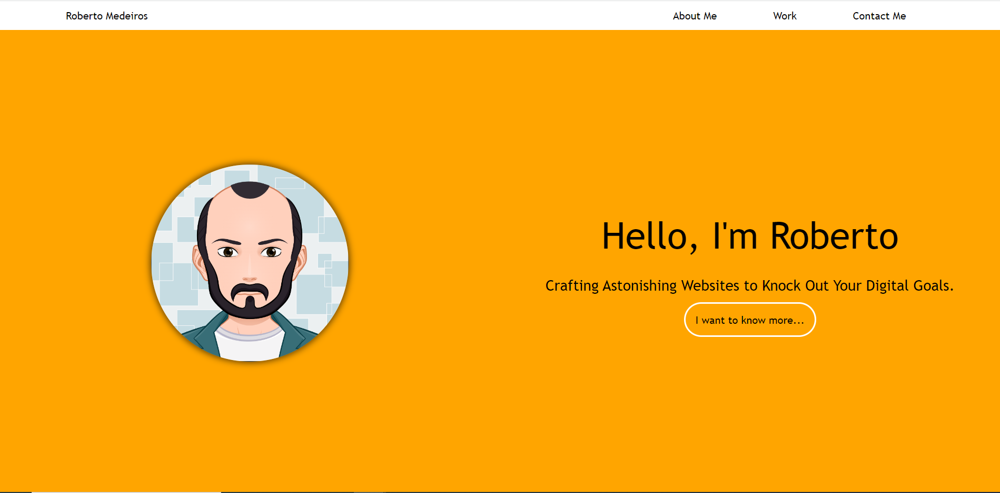

# 02 Portfolio Challenge

This challenge portfolio showcases skills and experience as a front-end web designer. Meticulously crafted using HTML CSS Javascript, it exemplifies proficiency in creating visually appealing and user-friendly web interfaces. This portfolio showcases my dedication to the craft and commitment to delivering engaging digital experiences based on the following acceptance criteria.

## Acceptance Criteria

    Page Load:
        Presents name, recent photo/avatar, and quick-access links to sections about the individual, their work, and contact details.

    Navigation Links:
        Clicking on navigation links scrolls the UI to the corresponding sections.

    Work Section:
        Displays titled images of applications in the 'Work' section.

    Application Image Size:
        Highlights the first application with a larger image size than the others.

    Application Link Interaction:
        Clicking on application images redirects users to the deployed applications.

    Responsive Layout:
        Adapts seamlessly to different screens and devices, ensuring optimal viewing experiences.

## Features

- A clean and modern design
- A responsive layout that looks great on all devices
- A well-organized presentation of your skills and experience
- A contact form for potential employers or clients to reach out to you

## Resources

- [HMLT CSS JavaScript]
- [jQuery Smooth Scroll](https://www.w3schools.com/howto/howto_css_smooth_scroll.asp) --> used to break the abruptly moving from links inside a page.
- [CSS Reset](https://github.com/elad2412/the-new-css-reset) --> To remove all styles set by default on the browsers.

## To Access

[View my portfolio website](https://link)

